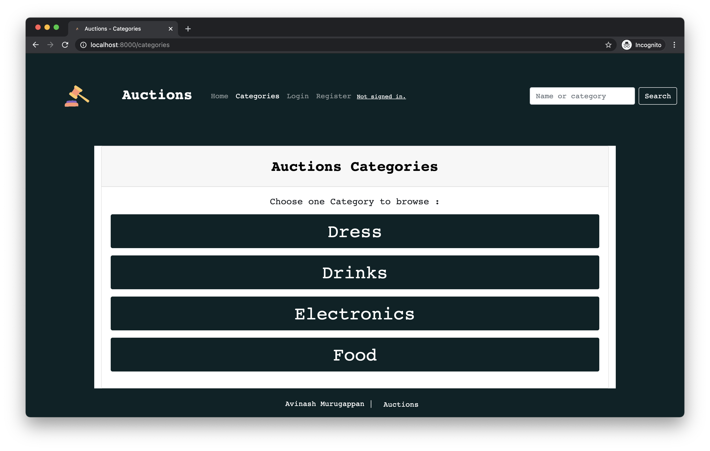

# Web Auction App - Buy & Sell stuffs 😃

A python django app (eBay-like) e-commerce auction site that will allow users to post auction listings, place bids on listings, comment on those listings, and add listings to a “watchlist.”


## Demo 😮
[live site](https://auctions-avi.herokuapp.com/)



## Inspiration 🤩
Always wanted to work and develop my skills with python django framework and so here I am implementing an auction app. 
## Installation 🛠️
 Install Django
    ```$ pip install Django==3.1.5```


## Usage 🚀
#### To launch the app:
  You’ll need to first run (To migrate databse) <br>
    ``` $ python manage.py makemigrations  ```<br>
    ``` $ python manage.py migrate ```<br> <br>
  Then, to start the server <br>
    ``` $ python manage.py runserver ```
    
Once the app is running, navigate to the `localhost` link provided:
<code> * Running on <b>http://127.0.0.1:8000/</b> (Press CTRL+C to quit)</code>


## Thanks 🙏
* [CS50W](https://cs50.harvard.edu/web/2020/) - CS50’s Web Programming with Python and JavaScript course by Haverd.

## Learn More 👻
* [Django](https://www.djangoproject.com/) - Django's official website and documentation to get started.

## License
This project is licensed under the MIT License.
